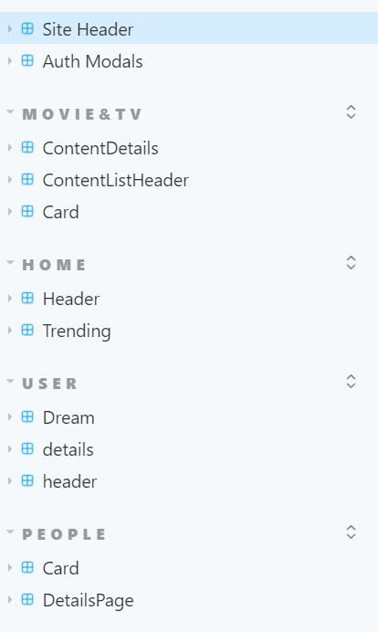
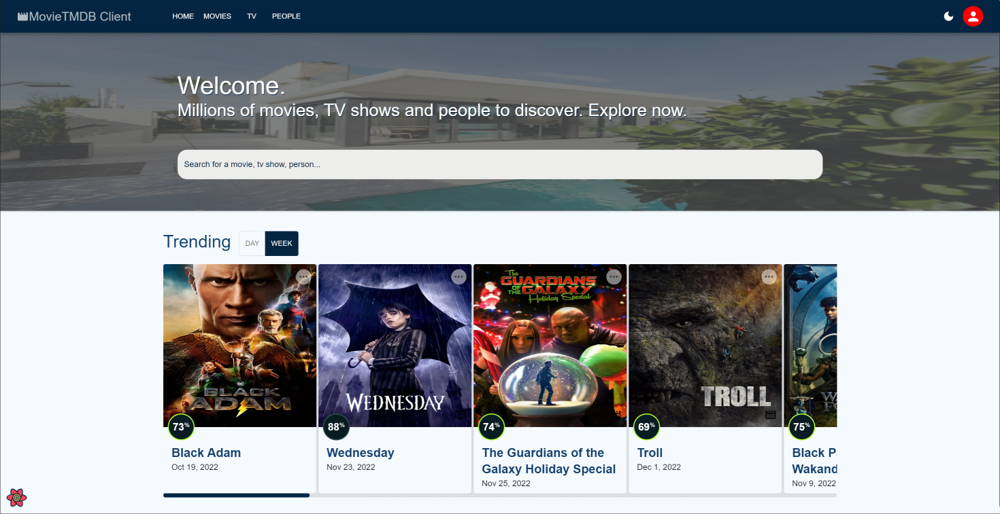
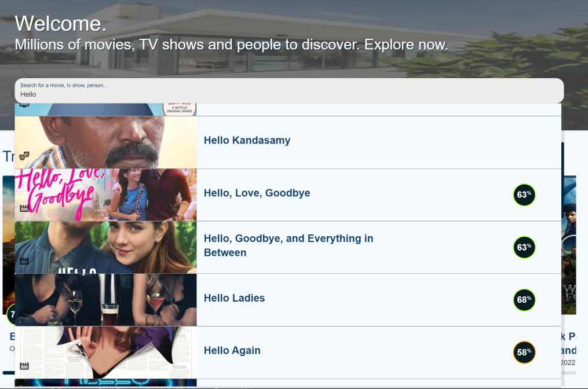
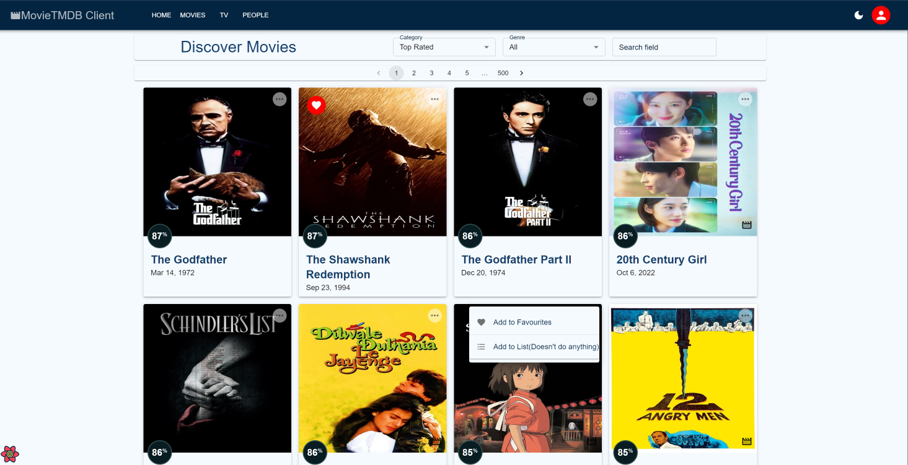
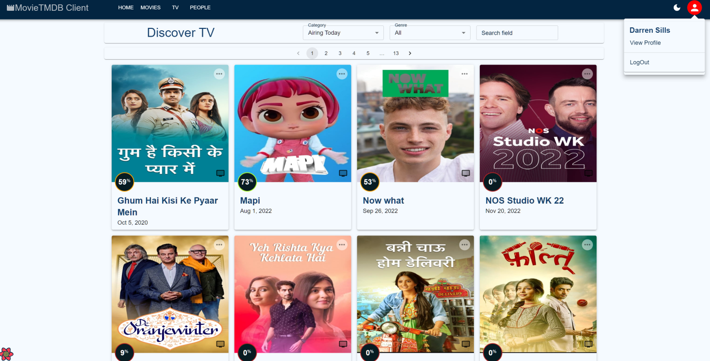
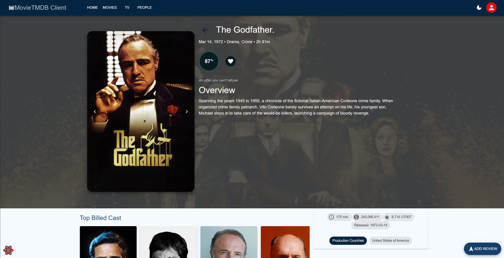
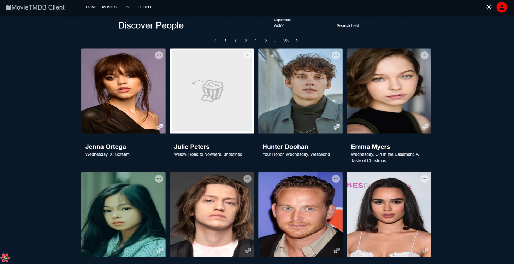
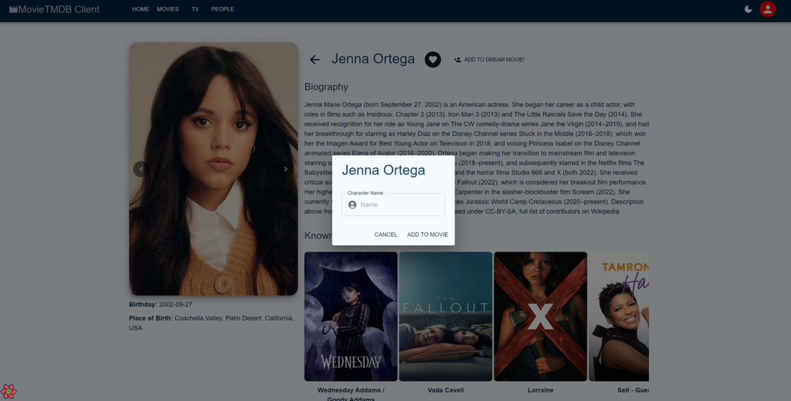
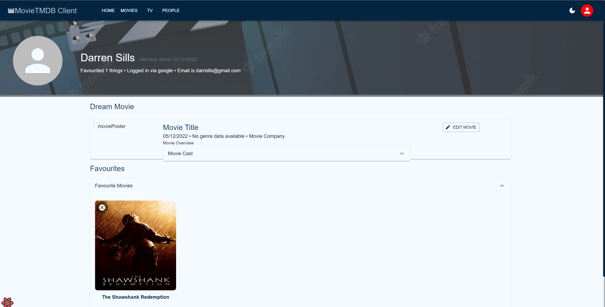

# Web App Dev 2 - Assignment 1 - ReactJS app

Name: **Darren Sills**

## Overview

### New Pages

+ Home Page 
    + Universal Search
    + Trending Content List (Day/week toggle)
+ (Modified) TV/Movies List Pages
    + Remade Cards (include rating and context menu)
    + Filter content by category(Top Rated, Newest, etc.)
    + Pagination
+ (Modified) TV/Movies Details Page
    + Complete New UI
    + Displays Top Cast
    + Reviews displayed via MUI dialogue instead of separate page
+ Actors List Page
    + Cards display most noteworthy movies under name
+ Actors Details Page
    + Best known movies they've had a part in displayed
    + Can add to dream movie here
+ User Profile Page
    + Displays some data about the user (date registered, number of favourites, etc.)
    + Displays the user's favourites as categorised lists
    + Dream movie editing
    
### New Features

+ Authentication (using Firebase)
+ Backend Persistence (using Firestore)
+ Sort content lists by category (Top Rated, Newest, etc.)
+ Rating display on card
+ Context menu on card to add to favourites
+ Full pagination
+ Dark/night mode toggle
+ Universal website search on home page
+ Toggle daily/weekly trending display on home page
+ List of categorised favourites on profile page
+ Create your dream movie
    + Can set all movie details
    + Can add cast members

## Setup requirements

Install Node.js if you don't have it, then open up a command prompt / terminal in the project directory.

Run 'npm install' to install dependencies, then 'npm start' to start the application.

## TMDB endpoints

+ /movies/{movie_id}/reviews - The user reviews of a movie.
+ /movie/{movie_id}/similar - A list of similar movies. 
+ /movie/{movie_id}/cast - A list of movie cast members. 
+ /tv/{category} - A list tv shows in the category.
+ /tv/{tv_id} - Details on the tv show.
+ /tv/{tv_id}/cast - A list of tv cast members.
+ /tv/{tv}/reviews - The user reviews of a tv.
+ /person/popular - A list of popular actors.
+ /person/{person_id} - Details on the actor.
+ /person/{person_ id}/combined_credits - A list of content the actor has featured in
+ /trending/all/{time} - A list of trending content
+ /search/all/{query} - Search the database for the query

## App Design

### Component catalogue

### UI Design

>Shows the web app home page. Tending toggle swaps between weekly/daily trending. Can search the database for with any query as shown above. (The banner image is placeholder)

>Shows a categorised, paged list of all movies in the database.

>Shows a categorised, paged list of all tv shows in the database.

>Page is the same for tv shows. Shows detailed information on the content. Scrolling down reveals a review section.

>Shows a categorised, paged list of all actors in the database. (Dark mode shown here)

>Shows the actors details, list of movies they're most known for and the add to dream movie button/modal you can see above.

>Shows the user's details including favourites in accordion components, and the edit dream movie section.

### Routing

+ / - home page with search and trending.
+ /tv/ - displays a list tv shows.
+ /tv/:id/ - shows details about the tv show.
+ /people/ - shows a list of people (Actors/directors)
+ /people/:id/ - a persons details.
+ /user/:uid/ - (protected) displays the current user's details.

## Independent learning

Mostly just used official documentation. MUI, Firebase and the TMDB API all have great documentation.
+ https://mui.com/material-ui/getting-started/overview/
+ https://firebase.google.com/docs
+ https://developers.themoviedb.org/3/getting-started/introduction

Other helpful sources would be various Stack Overflow posts or questions on the TMDB page that I wouldn't be able to find again at this point.
